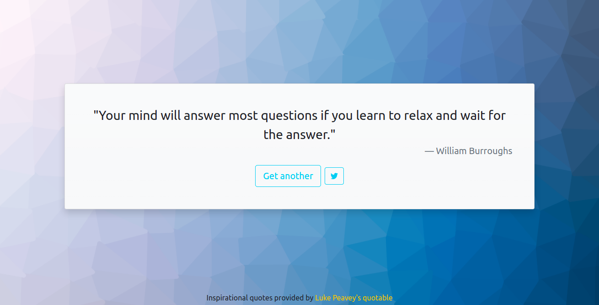

# Random Quote Machine

<p align="center">
    
</p>

Pequena aplicação web que exibe citações aleatórias. Random Quote Machine é um pequeno projeto para praticar o desenvolvimento com React

## Como usar

É preciso instalar a aplicação localmente com [Node.js](https://nodejs.org/) e executar os comandos:

```bash
    npm install
    npm start
```

## Feito com

- [React.js](https://reactjs.org/) - Biblioteca de desenvolvimento front-end para javascript
- [Bootstrap](https://getbootstrap.com/) - Framework de CSS para desenvolvimento de sites responsivos
- [quotable](https://github.com/lukePeavey/quotable) - API de citações feita por [Luke Peavey](https://github.com/lukePeavey)
